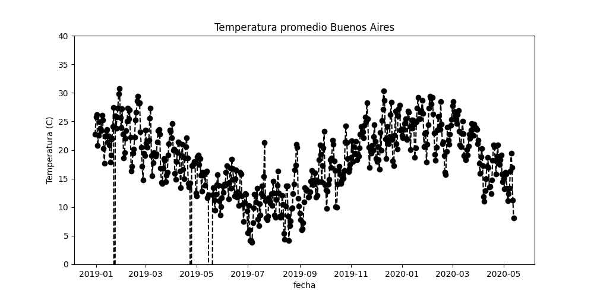

# 1. Definiciones

Definiciones. Tipos. Inspección ocular.
---

Una serie temporal (ST) es un conjunto de datos ordenados en el tiempo. Ejemplos de series temporales son mediciones de variables ambientales, señales de ultrasonido, sensores de movimiento durante un período, secuencias de imágenes ordenadas en el tiempo, etc.

Una ST puede ser univariada o multivariada. Por ejemplo, si tenemos una serie de medidas de temperatura a lo largo del tiempo, solo tenemos una variable, mientras que para una secuencia de imágenes el valor de cada pixel varía en el tiempo. Cada uno de los pixeles corresponde a una variable. 

Para un caso general de $m$ variables $\pmb{X} = (X_1, X_2, ..., X_m)$, la ST que consiste en $N$ datos temporales se puede representar simplemente como $\left[\pmb{X}(t_1), \pmb{X}(t_2),..., \pmb{X}(t_N)\right]$.

Además, es importante notar que los valores que pueden tomar las diferentes variables $X_i$ pueden ser discretos (como en el caso de los valores de intensidad de los píxeles), o continuos como en el caso de la temperatura. El proceso de obtención de las variables (proceso de medición) influye en estas características. Dado que se trabaja con datos digitales, a la postre todas las variables serán discretas.
 
## Tipos de series temporales

- __Continua__: está valuada para todos los instantes 

- __Discreta__: está valuada en algunos instantes
")
- __Periódica__: caso particular de serie repetitiva donde el patrón se repite en espacios de tiempo uniformes. Existe un período constante
")
- __Determinista__: puede ser expresada de manera unívoca por una expresión analítica. En el ejemplo de señal periódica anterior, la expresión exacta con la que fue generada es la siguiente $X(t)= \sin{(0.1 t)^2} \cos{(t)}$
- __No determinista__: no puede ser expresada analíticamente. Esto puede darse por dos motivos fundamentales:
    
    - No se tiene acceso a toda la información del problema.
    - La naturaleza del proceso tiene componentes aleatorias.

## Palabras finales
La primera tarea que se debe realizar para poder caracterizar una serie temporal es realizar una inspección de ésta, utilizando diferentes herramientas, entre ellas la inspección ocular de los tipos de datos que se tienen a partir de tablas, como así tambien gráficos de cada tipo de variables cuando estos puedan ser realizados.