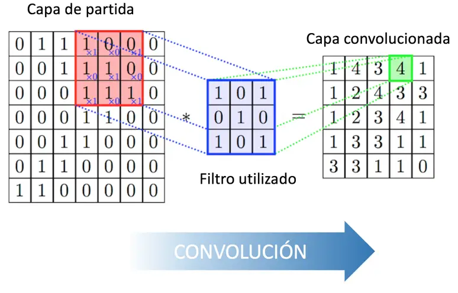
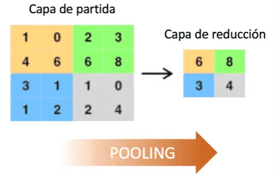

# Redes Convolucionales

Las redes neuronales convolucionales (CNN o ConvNet), son un caso especial de redes donde los parámetros de aprendizaje son los filtros (kernels) de convolución de los datos. Este mecanismo permite disminuir la cantidad de parámetros a entrenar porque un filtro de convolución guarda la información de un subconjunto de datos.

Supogamos un caso bidimensional, donde una capa de entrada es una imagen(matriz bidimensional), una CNN aplica varios kernels de convolución sobre la imagen como se muestra en la figura siguiente:

Al aplicar una convolución de un filtro $K$ de tamaño $(k\times l)$ sobre una matriz $M$ de $(m\times n)$ elementos, el resultado $(M\circ K)$ tendrá $(m-k, n-l)$ elementos. Si lo que se busca es preservar el tamaño de la imagen, reducirla, o alterar la manera de realizar estas convoluciones, existen dos operaciones muy populares denominadas __*padding*__ y __*stride*__.

> **padding**: agregado de elementos en los bordes que permite mantener la dimensionalidad. Si en la operación de convolución previa se agrega un padding $(p,q)$, la dimensionalidad de la convolución será $(M\circ K)$ tendrá $(m-k+2p, n-l+2q)$

> **stride**: salto entre pasos de convolución. Normalmente este parámetro es 1, lo que significa que se recorre la convolución aplicando el kernel moviéndolo de a un elemento. Si el stride es mayor que uno, se aplicará el kernel saltando un número predefinido de elementos. Así, si uno tiene un stride $(s,t)$ para cada dimensión. Las dimensiones de la convolución será $(M\circ K)$ tendrá $[(m-k+2p)/s+1, (n-l+2q)/t + 1 ]$

Mediante las operaciones de ***padding*** y ***stride*** se puede controlar el tamaño de salida de la imagen procesada

# Apilamiento de CNN

Estas capas de filtros pueden agruparse y apilarse al igual que en las redes neuronales densas que ya hemos visto. Para hacer apilados se suelen utilizar técnicas de reducción de dimensionalidad de manera análoga a los _embeddings_ de perceptrones multicapa. Las maneras de realizar reducciones de dimensionalidad pueden ser varias, como por ejemplo hacer uso de un stride adecuado, aunque esta operación no suele ser tan utilizada. La operación más común es el **pooling**, que consiste en tomar un subconjunto de pixeles contiguos y elegir un valor representativo de ellos, luego hacer lo propio para otro subconjunto que no contenga los elementos de los previos y así sucesivamente. Las dos opciones de valores representativos más comunes son elegir el máximo o el promedio del subconjunto. A continuación, se muestra en la figura un pooling tomando los elementos máximos.

 [Para ver la implementación de este tipo de redes, se ha desarrollado la siguiente notebook de python](./Tema-6.3.1-redes-convolucionales.ipynb)

