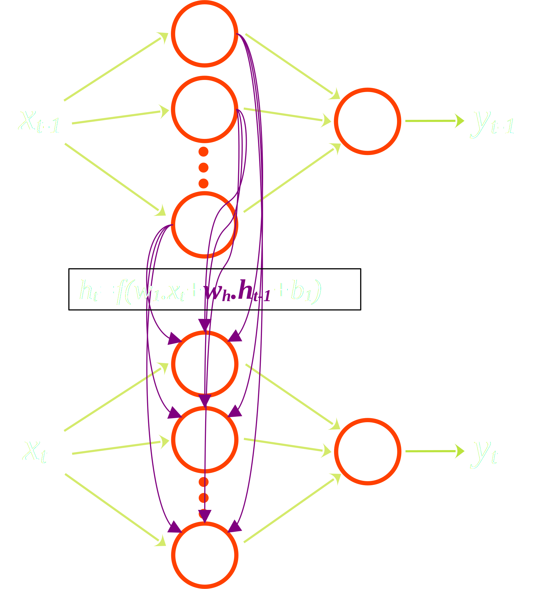
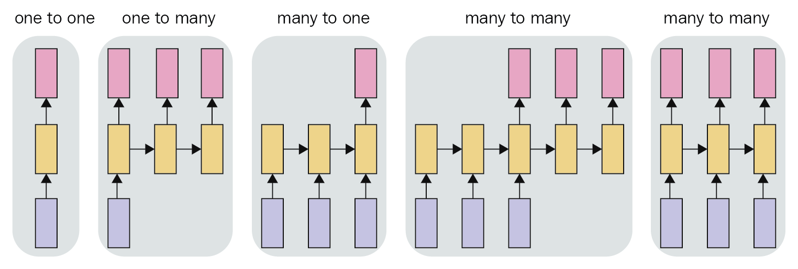
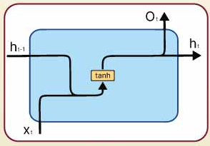

# Redes Neuronales Recurrentes

Las redes neuronales recurrentes (RNN), son redes de perceptrones como el perceptrón multicapa, pero concebidas para series de datos secuenciales como las series temporales. Se dice que las RNN poseen memoria, lo que se obtiene a partir de reutilizar las salidas de cada perceptrón en el estado previo. La arquitectura de una RNN es exactamente la de un perceptrón multicapa, con un nuevo tipo de procesamiento, que incluye un nuevo conjunto de parámetros.

Supongamos que tenemos una serie temporal $X(t) = [X_{t_0}, X_{t_1},... , X_{t_i}, ... X_{t_N} ]$, la cual debe ser utilizada para predicciones o para ser clasificadas. Una RNN se entrena a partir de los datos provistos tiempo a tiempo, utilizando los estados intermedios previos como nuevas entradas.

Figura 1: Esquema de una RNN.

En la Figura 1, se muestra que los estados de las capas intermedias, dependen del estado anterior, es decir que para el paso $t$ la salida de la capa intermedia $h^1$ utilizará el estado en la capa en $t-1$. Esto se hace almacenando la salida y reprocesandola, por ello recibe el nombre de recurrente.

Para el caso de un perceptrón multicapa con una capa oculta, la salida será simplemente $y_t = f(\bm{w} \cdot \bm{x_t})$, donde $f$ refiere a la función de activación. Para el caso de una RNN se debe observar que se tiene un nuevo grupo de parámetros $w_h$ que son los que multiplican al estado oculto previo. Estos parámetros conectan todas las neuronas dentro de cada capa oculta de manera aislada, es decir no conectan dos capas diferentes. La salida de cada capa de este nuevo tipo redes neuronales es la siguiente:

$$
\begin{equation}
h_t = f(\bm{w} \cdot \bm{x_t} + \bm{w_h} \cdot \bm{h_{t-1}} + b)
\end{equation}
$$

Luego, para optimizar los parámetros de este tipo de redes neuronales se debe tener en cuenta que al derivar se debe propagar no solo hacia atrás capa a capa, sino hacia atrás en la secuencia temporal.

## Tipos de problemas a resolver

Con las RNN se pueden abordar una gran variedad de problemas:

* Uno a uno: en este caso a cada elemento de la serie $x_t$, le corresponde un elemento de salida $y_t.$ Este caso es trivial, ya que se reduce al típico perceptrón multicapa.

* Uno a muchos: Este es el típico caso de redes generativas, donde a partir de una entrada, se generan muchas salidas

* Muchos a uno: Este es el caso de predicciones simples, como la predicción del último valor de una serie, o el problema de clasificación de una serie, donde al proveerse una cantidad de datos, se obtiene una clase posible

* Muchos a muchos: Este caso se da cuando se predicen varios valores posteriores en el problema de forecasting, o cuando se realiza un _codificado_ de la serie temporal, donde para cada entrada en el tiempo se obtiene una salida.

## Problemas de las RNN

Es sabido que las RNN comunes como las vistas hasta aquí tienen un grave problema cuando las series son largas, y es que los pesos de los pasos lejanos en el tiempo tienen gradientes que tienden a cero, o que explotan. Estos problemas son bien conocido y reciben el nombre de _gradient vanishing/exploding_. Para evitar este tipo de inconvenientes se suelen utilizar redes neuronales con memorias de corto y largo plazo. En esta categoría se encuentran las Gated Recurrent Units (GRU) y las Long-Term Short-Term Memory recurrent neural Networks (LSTM). Explicaremos en detalle esta última.

Para comprender el funcionamiento de las LSTM, es preciso analizar nuevamente lo que sucede dentro de cada unidad (neurona) de una RNN.

Lo que sucede dentro de cada unidad de una RNN simple, como se describe matemáticamente en la Ecuación (1), se puede esquematizar
Como en la siguiente figura:

donde la función de activación $f$, corresponde a una tangente hiperbólica, que es la usual. En la Figura, $O_t$ corresponde a la salida, mientras que $h_t$ es la salida del estado interno, que será utilizado en el paso siguiente. Como se puede ver, durante el entrenamiento, para actualizar los pesos $w_h,$ se requiere desarrollar la serie hasta el comienzo, donde la propagación de los valores de los pesos

